

# final-project-skeleton

**Team Number: 18**

**Team Name: Poet of post office**

| Team Member Name | Email Address           |
| ---------------- | ----------------------- |
| Lige Tan         | ligtan@seas.upenn.edu   |
| Tao Yu           | taoyu106@seas.upenn.edu |
| Mutian Yuan      | yuanmu@seas.upenn.edu   |

**[GitHub Repository URL](https://github.com/upenn-embedded/final-project-f25-poet-of-post-office.git) https://github.com/upenn-embedded/final-project-f25-poet-of-post-office**

**GitHub Pages Website URL:** [for final submission]*

## Final Project Proposal

### 1. Abstract

*In a few sentences, describe your final project.*

We will design a healthy version of Iron Man gloves. When the palm is opened, the circular LED on the palm will light up. When the hand forms a fist, the laser rays on the back of the hand will be activated. These functions are mainly determined by the states of three fingers equipped with flex sensors. Of course, the three 0/1 signals can result in 8 different states. Accordingly, we will add more functions. For example, when the "victory" gesture is made by hand, the LCD will display "victory". Meanwhile, the sensors that monitor the health of the hands will be connected to the LCD and mobile phone via WIFI, and the health status will be displayed in real time.

### 2. Motivation

*What is the problem that you are trying to solve? Why is this project interesting? What is the intended purpose?*

Jokingly speaking, Iron Man can check his own health status at any time through it.

This is more of a toy-like product aimed at teenagers who enjoy science fiction. They can experience the pleasure of wearing Iron Man gloves, and experience the various changes brought about by different gestures to the gloves.At the same time, health information such as heart rate can also be detected in real time and displayed.

### 3. System Block Diagram

*Show your high level design, as done in WS1 and WS2. What are the critical components in your system? How do they communicate (I2C?, interrupts, ADC, etc.)? What power regulation do you need?*

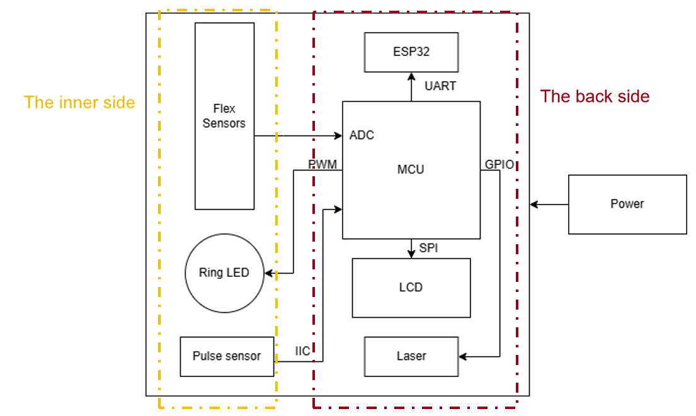

### 4. Design Sketches

*What will your project look like? Do you have any critical design features? Will you need any special manufacturing techniques to achieve your vision, like power tools, laser cutting, or 3D printing?  Submit drawings for this section.*

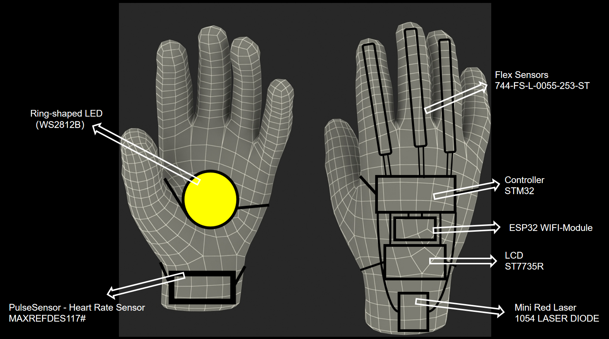

In our plan, there are no specific manufacturing techniques required now. All that is needed is to connect all the components together.

### 5. Software Requirements Specification (SRS)

*Formulate key software requirements here. Think deeply on the design: What must your device do? How will you measure this during validation testing? Create 4 to 8 critical system requirements.*

*These must be testable! See the Final Project Manual Appendix for details. Refer to the table below; replace these examples with your own.*

**5.1 Definitions, Abbreviations**

ESP32-connect WiFi and display http webpage on cell phone. I will use ESP-IDF to program.

**5.2 Functionality**

| ID              | Description                                                                                                  |
| --------------- | ------------------------------------------------------------------------------------------------------------ |
| WiFi connection | ESP32 start using AP mode to provide user interface to key in the WiFi credentials, then attempt to connect. |
| Webpage         | After connected to WiFi, it switches to STA mode, use a http webpage to display heart rate and gesture.      |
| Decode sensors  | Decode heart rate and flex sensor to identify real time gesture and heart rate                               |
| Actuation       | Provide control signal\data to the output devices.                                                           |

### 6. Hardware Requirements Specification (HRS)

*Formulate key hardware requirements here. Think deeply on the design: What must your device do? How will you measure this during validation testing? Create 4 to 8 critical system requirements.*

*These must be testable! See the Final Project Manual Appendix for details. Refer to the table below; replace these examples with your own.*

**6.1 Definitions, Abbreviations**

Here, you will define any special terms, acronyms, or abbreviations you plan to use for hardware

1. Ring-shaped LED: WS2812B
2. Flex Sensor: 744-FS-L-0055-253-ST
3. Heart rate sensor: MAXREFDES117#
4. Laser: 1054 LASER DIODE 650NM 5MW 10MM DIA
5. MCU: STM32F103C8T6
6. WIFI: ESP32-S3
7. LCD:ST7735R

**6.2 Functionality**

| ID                | Description                                                                                                                                                        |
| ----------------- | ------------------------------------------------------------------------------------------------------------------------------------------------------------------ |
| Ring-shaped LED   | When all the flex sensors have low resistance values, the LED lights up, and the flashing mode can be changed through the button, such as constant on or flashing |
| Flex Sensor       | The resistance value changes with the degree of bending. It will be connected to the ADC port of the MCU.                                                          |
| Heart rate sensor | Detecting real-time heart rate.                                                                                                                                    |
| Laser             | When all the flex sensors have low resistance values, the laser starts lasing.                                                                                    |
| ESP32-S3          | WIFI connection                                                                                                                                                    |
| STM32F103C8T6     | Microcontroller                                                                                                                                                    |
| LCD               | Display heart rate and various expressions corresponding to different gestures                                                                                     |

### 7. Bill of Materials (BOM)

*What major components do you need and why? Try to be as specific as possible. Your Hardware & Software Requirements Specifications should inform your component choices.*

*In addition to this written response, copy the Final Project BOM Google Sheet and fill it out with your critical components (think: processors, sensors, actuators). Include the link to your BOM in this section.*

* Ring-shaped LED: WS2812B
* Flex Sensor: 744-FS-L-0055-253-ST
* Heart rate sensor: 426-SEN0203
* Laser: 1054 LASER DIODE 650NM 5MW 10MM DIA
* MCU: STM32F103C8T6
* WIFI: ESP32-S3
* LCD: ST7735R

### 8. Final Demo Goals

*How will you demonstrate your device on demo day? Will it be strapped to a person, mounted on a bicycle, require outdoor space? Think of any physical, temporal, and other constraints that could affect your planning.*

On the final demonstration day, we will have one person wearing the glove on his right hand. We will firstly show the WiFi connection module, with the ESP-32 working in SoftAP mode to provide a interface for using to select the scanned WiFi around and then key in the password. The ESP-32 will then switch to STA mode and connect to the corresponding wifi using the saved credentials. Then we will show the LCD display of heart rate and words generated by the gesture. The information on LCD will also be posted on the ESP-32 http page. Different gestures identified by the flex sensor would generate corresponding laser, LED and LCD display effect, we will show them one by one.

The light condition would be a constraint, to demonstrate the LCD, LED and laser, we'd prefer to present them in a dimmer place, otherwise it might not be as visible as we wish.

### 9. Sprint Planning

*You've got limited time to get this project done! How will you plan your sprint milestones? How will you distribute the work within your team? Review the schedule in the final project manual for exact dates.*

| Milestone  | Functionality Achieved                              | Distribution of Work |
| ---------- | --------------------------------------------------- | -------------------- |
| Sprint #1  | Finish developing the drivers of input sensors      | Together             |
| Sprint #2  | Finish developing the drivers of output sensors.    | Together             |
| MVP Demo   | Put everything together, show all the functionality | Together             |
| Final Demo | Finalize the wearable external design               | Together             |

**This is the end of the Project Proposal section. The remaining sections will be filled out based on the milestone schedule.**

## Sprint Review #1

### Last week's progress11.14

1). Hardware: The realization of LED Strip function in the back side.

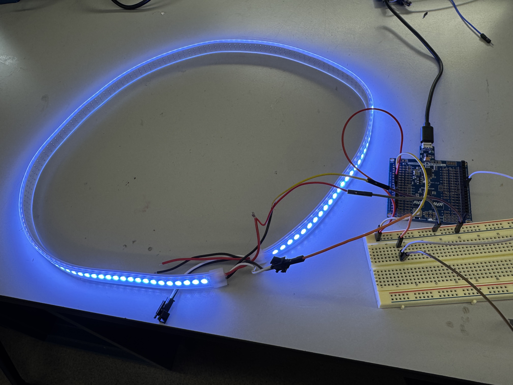

2). Synchronous display on LCD screen

[LCD Display](https://drive.google.com/file/d/19v0RNVAUWMJptfUpp-tgLCysFA39JAFc/view?usp=sharing)

As shown in the video, of course we will place all these components on the gloves later. When the hand makes a fist, the LED strip on the back of the hand will light up and the LCD will display "BIST". When the palm is opened, the LED strip on the back of the hand will turn off and the LCD will display "PALM". The code can be view in

3). Wifi connection module on ESP32.

We have completed the WiFi-connection framework for the system, the device will automatically detect Wi-Fi and connect to stored Wi-Fi credentials, or give a AP configuration page if none is found. On top of this, I have added a status server module to automatically update the status, including current gesture, detected words, and other info like heart rate and power level to the HTTP webpage.

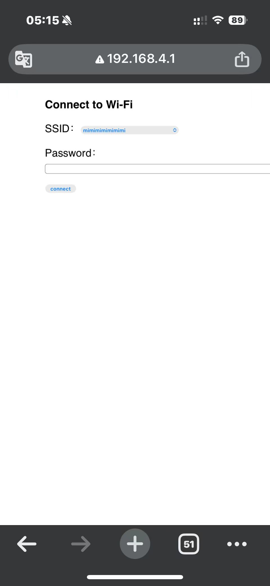

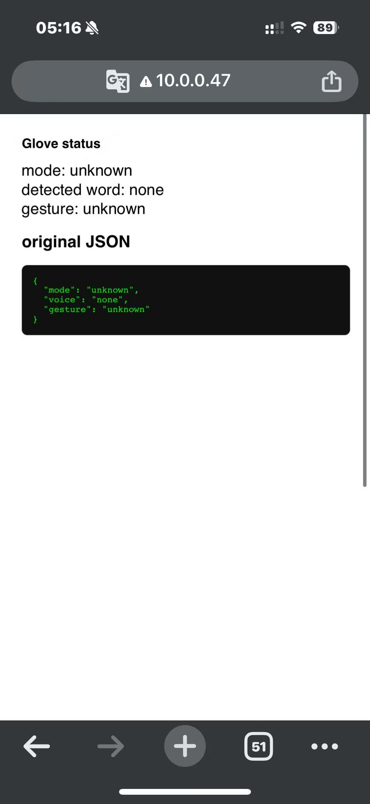

### Current state of project

We have made progress on both the software and hardware aspects of the project and have completed components including the dorsal hand LED strip, LCD display, Wi-Fi module integration, and the preliminary training of the speech recognition model. These are all important components of the final project.

However, since not all of the components have arrived yet, some tasks cannot be carried out at this stage.

### Next week's plan

1). Complete the connection of the palm-side ring-shaped LED and its interaction with the LCD.

2). Complete the connection of the heart rate sensor and its interaction with the LCD, Wi-Fi, and other modules

3). Finish recording the trainning set for the speech recognition module (Jarvis).

## Sprint Review #2

### Last week's progress

1). The function of controlling the light ring and light strip by simulating the bending of fingers through a flex sensor has been realized.

[Flex Sensor](https://drive.google.com/file/d/1lbeoC_tvgm1Ih8rBVLQ2_Dmnt3gSG-Nq/view?usp=sharing)

As can be seen in this vedio, When the flex sensor is vertical, the light ring located at the palm will light up, and at the same time, the LCD will display "Palm". When the flex sensor is bent, the light strip located on the back of the hand will light up, and at the same time, the LCD will display "Fist". The flex sensor will be attached to the finger to simultaneously measure the degree of finger bending.

2). Heart rate is measured by the heart rate sensor and displayed synchronously.

[FlexSensor&amp;HeartRateSensor](https://drive.google.com/file/d/1Z80Dl_T5UBR0F0Mfu131UPJBLr-E7bO-/view?usp=sharing)

As can be seen in this vedio, the function of heart rate sensor has been added. Heart rate can be detected and displayed in real time.

All the codes can be viewed in "glove\src" and the main code is [main.c](glove\src\main.c).

3). Pin Assign

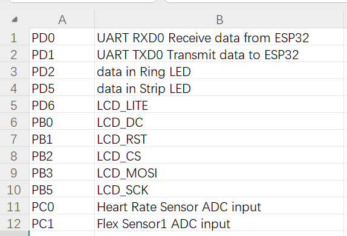

### Current state of project

At present, the overall system architecture has been constructed and most of the functional modules have been implemented.

The required components are almost all in place, although some of them were purchased by ourselves from Amazon.

### Next week's plan

1). We will find a way to transfer and install all the components onto the actual glove.

2). Add two more flex sensors for other fingers, and compute logic for the different gesture.

3). Establish communication between ESP32 and ATMEGA328PB, enable display of heart rate and gesture on webpage.

4). Initialize microphone, start recording training set for the voice identification model.

## MVP Demo

1. Show a system block diagram & explain the hardware implementation.
   We changed the Laser to LED Stripe for the sake of safety considerations

   
2. Explain your firmware implementation, including application logic and critical drivers you've written.

   

   In this system, the MCU (ATmega328PB) is the central controller: it samples the flex sensors through the ADC driver and reads heart-rate data from the pulse sensor via the  I²C driver , then processes these inputs to determine gesture and pulse status. Based on this logic, the MCU drives the Ring LED using a  PWM driver , updates visual information on the LCD through an  SPI driver , and controls the LED stripe with GPIO drivers for on/off or pattern outputs. A UART driver links the MCU to the ESP32, enabling wireless data transmission or external communication, so that the whole system forms a closed loop of sensing, processing, display, and connectivity.

   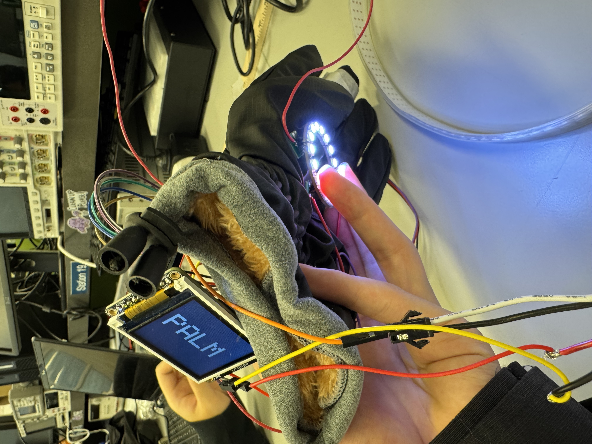

   
3. Demo your device.
4. Have you achieved some or all of your Software Requirements Specification (SRS)?

   1). We have completed the WiFi-connection framework for the system, the device will automatically detect Wi-Fi and connect to stored Wi-Fi credentials, or give a AP configuration page if none is found. On top of this, I have added a status server module to automatically update the status, including current gesture, detected words, and other info like heart rate and power level to the HTTP webpage.
   [WIFI](https://drive.google.com/file/d/1iSwOPID-X6vIYjviRnFwTrfnH7hro3eC/view?usp=sharing)

   2). We have completed the initialization of the microphone module, and can start recording our data set for training the voice recognition module. [Voice](https://drive.google.com/file/d/1soPLtAB4GnjwQjCOkziklw4d8rTlMdYR/view?usp=sharing)
5. Have you achieved some or all of your Hardware Requirements Specification (HRS)?

   1). The function of controlling the light ring and light strip by simulating the bending of fingers through a flex sensor has been realized.

   2). Heart rate is measured by the heart rate sensor and displayed synchronously
6. Show off the remaining elements that will make your project whole: mechanical casework, supporting graphical user interface (GUI), web portal, etc.

   The flex sensor that hasn't been delivered yet, we still need two more.
7. What is the riskiest part remaining of your project?

   Assembly of the complete glove: All components need to be installed onto the glove, which is quite challenging.
8. What questions or help do you need from the teaching team?

   We promptly presented the MVP Demo to TA and received a positive response.

## Final Project Report

Don't forget to make the GitHub pages public website!
If you’ve never made a GitHub pages website before, you can follow this webpage (though, substitute your final project repository for the GitHub username one in the quickstart guide):  [https://docs.github.com/en/pages/quickstart](https://docs.github.com/en/pages/quickstart)

### 1. Video

[Insert final project video here]

[video](https://drive.google.com/file/d/1AGv__O5X_WSkikyQ7JaI45YAZ8d5JuMV/view?usp=sharing)

* The video must demonstrate your key functionality.
* The video must be 5 minutes or less.
* Ensure your video link is accessible to the teaching team. Unlisted YouTube videos or Google Drive uploads with SEAS account access work well.
* Points will be removed if the audio quality is poor - say, if you filmed your video in a noisy electrical engineering lab.

### 2. Images

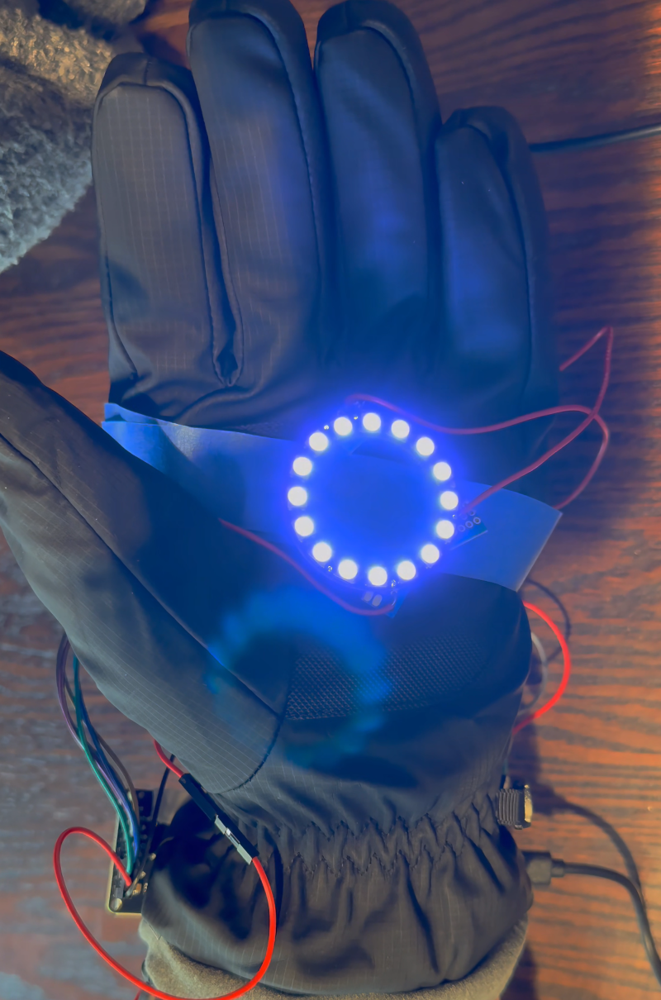

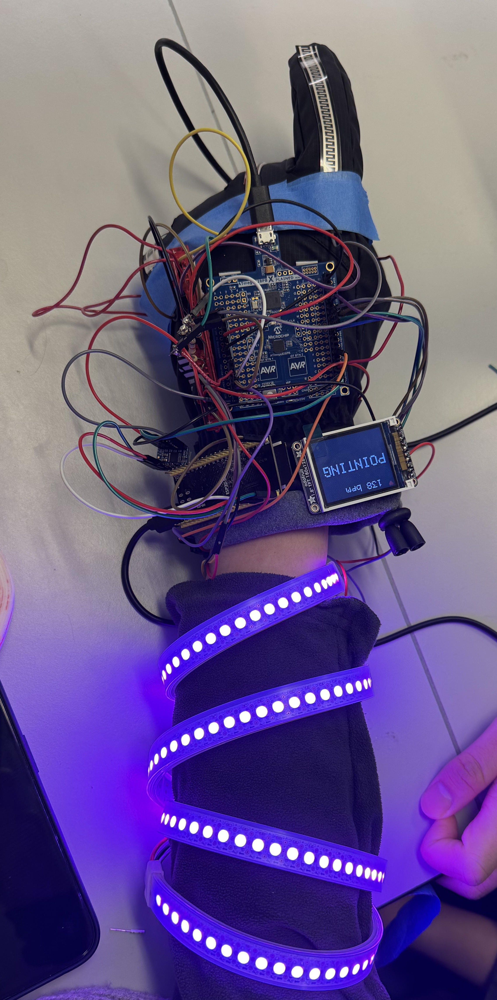

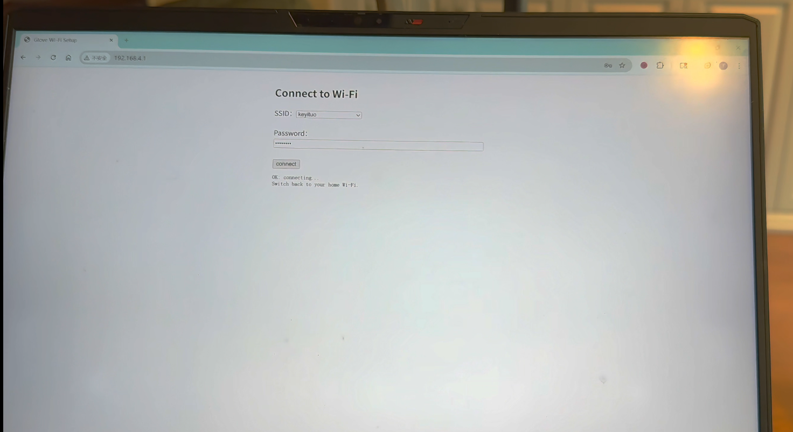

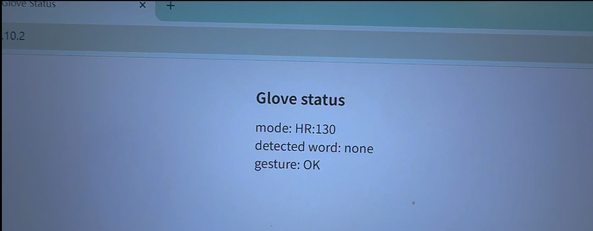

*Include photos of your device from a few angles. If you have a casework, show both the exterior and interior (where the good EE bits are!).*

### 3. Results

*What were your results? Namely, what was the final solution/design to your problem?*

* **The classic functions of Iron Man's gloves have been realized:** The palm cannon (PALM) and the fist (FIST) maneuvers.
* **The function of controlling the light ring and light strip by simulating the bending of fingers through three flex sensor has been realized**: By combining state-machine logic with the use of ADCs, three flex sensors can provide 3-bit gesture encoding with real-time updates. With these 3 bits, we can represent eight commonly used hand gestures, such as OK (010), Pointing (101), Victory (100), and so on. Besides, the corresponding gesture information will be displayed on the LCD.
* **Achieved health function:** Real-time detection and display of heart rate has been achieved by applying Timers and Interrupts.
* **Implemented the IoT function:**  The WiFi-connection for the system was conpleted, the device will automatically detect Wi-Fi and connect to stored Wi-Fi credentials, or give a AP configuration page if none is found. On top of this, a status server module was added to automatically update the status, including current gesture and other info like heart rate and power level to the HTTP webpage.

#### 3.1 Software Requirements Specification (SRS) Results

*Based on your quantified system performance, comment on how you achieved or fell short of your expected requirements.*

*Did your requirements change? If so, why? Failing to meet a requirement is acceptable; understanding the reason why is critical!*

*Validate at least two requirements, showing how you tested and your proof of work (videos, images, logic analyzer/oscilloscope captures, etc.).*

| ID     |                                                                                                                                                                                          Description                                                                                                                                                                                          | Validation Outcome                                                                                                                                                                                       |
| ------ | :-------------------------------------------------------------------------------------------------------------------------------------------------------------------------------------------------------------------------------------------------------------------------------------------------------------------------------------------------------------------------------------------: | -------------------------------------------------------------------------------------------------------------------------------------------------------------------------------------------------------- |
| SRS-01 |                                                                                                               The ATmega328PB shall measure heart-rate using ADC sampling driven by Timer1 ISR, compute IBI, and output BPM within the valid physiological range (40–170 bpm).                                                                                                               | **Confirmed.** The BPM values are compared with the measure results from Apple Watch. However it sometimes gives unexpected results due to hardware reasons.                                       |
| SRS-02 |                                                                                                                   The system shall classify hand gestures using three flex sensors, converting ADC readings into a 3-bit gesture code (0–7) based on threshold comparison.                                                                                                                   | **Confirmed.** Repeated fist/palm/other finger motions were recorded. LED and LCD changes match the 3-bit output.                                                                                 |
| SRS-03 |                                                                                                                                             The ATmega328PB shall transmit the current BPM and gesture state to the ESP32 using the UART protocol                                                                                                                                             | **Confirmed.** UART output are shown on the HTTP webpage.                                                                                                                                          |
| SRS-04 |                                                                                                                                        The LCD UI shall display the current BPM, the current gesture name, and a continuously beating heart animation.                                                                                                                                        | **Confirmed.** LCD output recorded in video demonstrates correct BPM text updates, real-time gesture rendering, and smooth heart-size toggling every ~200 ms.                                      |
| SRS-05 |                                                                                                                                         The WS2812 LED strip and LED ring shall change color according to the gesture code using predefined patterns.                                                                                                                                         | **Confirmed.** Visual inspection during testing shows gesture transitions immediately update LED colors.                                                                                           |
| SRS-06 |                                                                                                            The ESP32 shall correctly record microphone audio through I2S,  execute keyword-spotting inference (“Jarvis” vs. “Other”) using the deployed TFLite Micro model.                                                                                                            | **Partially Confirmed.** The full audio pipeline is verified functional: I2S recording works, ring buffer is stable. However, the model that are deployed does not maintain satisfactory accuracy. |
| SRS-07 | The ESP32 shall host a Wi-Fi provisioning AP with an embedded webpage for scanning available networks and entering credentials. After provisioning, the ESP32 shall switch to STA mode, auto-connect to the saved Wi-Fi credentials, and store IP information. Once STA is connected, the ESP32 shall run a simple HTTP status server displaying mode, detected voice, and gesture values. | **Confirmed.** AP mode launches successfully; The web dashboard loads at the assigned IP, updates via  JSON polling, and reflects changes from both KWS and ATmega UART data.                     |

#### 3.2 Hardware Requirements Specification (HRS) Results

*Based on your quantified system performance, comment on how you achieved or fell short of your expected requirements.*

*Did your requirements change? If so, why? Failing to meet a requirement is acceptable; understanding the reason why is critical!*

*Validate at least two requirements, showing how you tested and your proof of work (videos, images, logic analyzer/oscilloscope captures, etc.).*

| ID     | Description                                                                                               |                                                                                                                                 Validation Outcome                                                                                                                                 |
| :----- | --------------------------------------------------------------------------------------------------------- | :---------------------------------------------------------------------------------------------------------------------------------------------------------------------------------------------------------------------------------------------------------------------------------: |
| HRS-01 | Flex Sensor.  Used to obtain information about the degree of finger bending and perform 3-bit encoding. |                                                    **Achieved**. Based on the state-machine logic and use of ADC, the work of flex sensor achieved our expected requirements as you can see in the video and images above                                                    |
| HRS-02 | Heart Rate Sensor. Used for real-time detection and transmission of heart rate                           | **Almost Achieved.**  It can detect the heart rate in real time and send data back. Most of the time, the heart rate reading is quite normal. However, sometimes it may be a little higher than the actual situation. We speculate that this is due to the contact issue.  |
| HRS-03 | LED Stripe & LED Ring                                                                                     |                                                               **Achieved.** As shown in the video and pictures above, the light ring on the palm and the light strips on the arm are all functioning properly.                                                               |
| HRS-04 | LCD                                                                                                       |                                                  **Achieved.** As shown in the video and pictures above, LCD can display real-time and accurate information about different gestures as well as the heart rate at all times                                                  |
| HRS-05 | Laser                                                                                                     |                                                                                    **Fell**. Taking into account power and security issues, we did not choose to use laser as suggested by TA.                                                                                    |

### 4. Conclusion

Reflect on your project. Some questions to address:

* What did you learn from it?

We learned a lot about taking a system from block diagram to real hardware and firmware. Technically, the biggest lessons were about sharing limited resources on a small MCU: multiplexing several flex sensors and a pulse sensor on the ATmega328PB's ADC, writing timing-critical WS2812 drivers in C, and building a simple but robust UI layer on top of these low-level modules. Generally, we also got practice thinking in terms of data paths instead of single features. In addition, the ability to work collaboratively as a team has also been greatly enhanced.

* What went well?

Gesture recognition and LCD display are the parts that have made the most progress. Starting from a simple two-state demo (FIST vs PALM) and then generalizing to three flex sensors and 3-bit gesture encoding gave us a smooth path from proof-of-concept to richer interaction.

* What accomplishments are you proud of?

I am especially proud that the system now supports up to eight distinct hand gestures, while still running on an 8-bit microcontroller, and that the visual design (hand renderings, system diagram, and on-screen UI) makes the hardware architecture clear even to someone seeing it for the first time.

* Did you have to change your approach?

Initially we wanted to use a small laser module on the glove, but powering it safely and consistently would have complicated the design. We were also concerned about eye safety and reflections during demos. As a result, we switched to a forearm-mounted LED strip, which is easier to drive from the 5 V rail and much safer for interactive use.

* What could have been done differently?

One thing we could have done differently is to use an IMU such as an MPU6050 instead of (or in addition to) the flex sensors to capture gesture information. An IMU would let us track hand orientation and dynamic motion, not just finger bending, which could support richer and more robust gesture recognition. It would also avoid some of the analog noise and threshold-tuning issues we ran into with the flex sensors. Of course, this would come at the cost of more complex signal processing and calibration.

* Did you encounter obstacles that you didn’t anticipate? & What could be a next step for this project?

We did run into an obstacle we didn't anticipate around the ESP-based voice interface. Our idea was to build a tiny “Jarvis” for the glove that could recognize specific spoken commands, and we even trained a model locally. However, the final model turned out to be too large to fit and run efficiently on the ESP, which blocked this feature for the current prototype. Therefore, as for the next step, we want to explore lightweight keyword-spotting models and model compression/quantization so that a smaller, embedded-friendly version of this speech interface can actually run on the ESP.

## References

Fill in your references here as you work on your final project. Describe any libraries used here.
