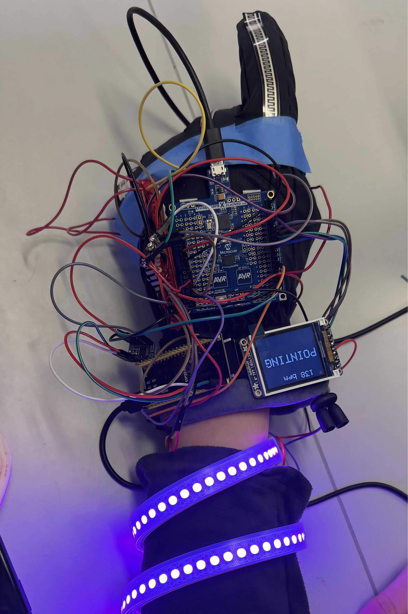

# Iron Man's Healthy Glove

ESE5190 Final Project - Team: Poet-of-Post-Office

# 1. Final project Video

You can find our project video by clicking this [link](https://drive.google.com/file/d/1OxCNUOv104NPlGW3K9_btHVaHvuEmDWO/view?usp=drive_link) or watching the video below:

  <video style="max-width:960px; width:100%;" controls>
    <source src="./video/team18glove.mp4" type="video/mp4">
  </video>

# 2. Final projects Images

  
  
  
  

# 3. Result

The final system successfully delivers the classic functions of Iron Man's gloves, including both the palm-cannon (PALM) and fist (FIST) maneuvers. By integrating ADCs with state-machine logic, the gloves can interpret the bending of three flex sensors to generate a 3-bit gesture code, enabling reliable recognition of gestures such as OK (010), Pointing (101), and Victory (100), with corresponding outputs shown on the LCD. Additionally, the system achieves real-time heart-rate monitoring through timers and interrupts, providing continuous on-device health feedback. The IoT functionality is also fully implemented: the ESP32 automatically connects to Wi-Fi using stored credentials or presents a provisioning page when needed, and a status server updates key information—such as current gesture, detected voice command, and system parameters—on the HTTP dashboard.

# 4. Softeware Requirements Specification

| ID     |                                                                                                                                                                                          Description                                                                                                                                                                                          | Validation Outcome                                                                                                                                                                                       |
| ------ | :-------------------------------------------------------------------------------------------------------------------------------------------------------------------------------------------------------------------------------------------------------------------------------------------------------------------------------------------------------------------------------------------: | -------------------------------------------------------------------------------------------------------------------------------------------------------------------------------------------------------- |
| SRS-01 |                                                                                                               The ATmega328PB shall measure heart-rate using ADC sampling driven by Timer1 ISR, compute IBI, and output BPM within the valid physiological range (40–170 bpm).                                                                                                               | **Confirmed.** The BPM values are compared with the measure results from Apple Watch. However it sometimes gives unexpected results due to hardware reasons.                                       |
| SRS-02 |                                                                                                                   The system shall classify hand gestures using three flex sensors, converting ADC readings into a 3-bit gesture code (0–7) based on threshold comparison.                                                                                                                   | **Confirmed.** Repeated fist/palm/other finger motions were recorded. LED and LCD changes match the 3-bit output.                                                                                 |
| SRS-03 |                                                                                                                                             The ATmega328PB shall transmit the current BPM and gesture state to the ESP32 using the UART protocol                                                                                                                                             | **Confirmed.** UART output are shown on the HTTP webpage.                                                                                                                                          |
| SRS-04 |                                                                                                                                        The LCD UI shall display the current BPM, the current gesture name, and a continuously beating heart animation.                                                                                                                                        | **Confirmed.** LCD output recorded in video demonstrates correct BPM text updates, real-time gesture rendering, and smooth heart-size toggling every ~200 ms.                                      |
| SRS-05 |                                                                                                                                         The WS2812 LED strip and LED ring shall change color according to the gesture code using predefined patterns.                                                                                                                                         | **Confirmed.** Visual inspection during testing shows gesture transitions immediately update LED colors.                                                                                           |
| SRS-06 |                                                                                                            The ESP32 shall correctly record microphone audio through I2S,  execute keyword-spotting inference (“Jarvis” vs. “Other”) using the deployed TFLite Micro model.                                                                                                            | **Partially Confirmed.** The full audio pipeline is verified functional: I2S recording works, ring buffer is stable. However, the model that are deployed does not maintain satisfactory accuracy. |
| SRS-07 | The ESP32 shall host a Wi-Fi provisioning AP with an embedded webpage for scanning available networks and entering credentials. After provisioning, the ESP32 shall switch to STA mode, auto-connect to the saved Wi-Fi credentials, and store IP information. Once STA is connected, the ESP32 shall run a simple HTTP status server displaying mode, detected voice, and gesture values. | **Confirmed.** AP mode launches successfully; The web dashboard loads at the assigned IP, updates via  JSON polling, and reflects changes from both KWS and ATmega UART data.                     |

# 5. Hardware Requirements Specification

| ID                    | Description                                                                                                                                                                                                                                                                  |
| --------------------- | ---------------------------------------------------------------------------------------------------------------------------------------------------------------------------------------------------------------------------------------------------------------------------- |
| Flex Sensor           | Achieved. Based on the state-machine logic and use of ADC, the work of flex sensor achieved our expected requirements as you can see in the video and images above.                                                                                                     |
| Heart Rate Sensor     | Almost achieved.It can detect the heart rate in real time and send the data back. Most of the time, the heart rate reading is quite normal. However, sometimes it may be a little higher than the actual situation. We speculate that this is due to the contact issue. |
| LED Stripe & LED Ring | Achieved. As shown in the video and pictures above, the light ring on the palm and the light strips on the arm are all functioning properly.                                                                                                                                 |
| LCD                   | Achieved. As shown in the video and pictures above, LCD can display real-time and accurate information about different gestures as well as the heart rate at all times.                                                                                                |
| Laser                 | Fell. Taking into account power and security issues, we did not choose to use laser as suggested by TA.                                                                                                                                                                     |

# 6. Conclusion

We learned a lot about taking a system from block diagram to real hardware and firmware. Technically, the biggest lessons were about sharing limited resources on a small MCU: multiplexing several flex sensors and a pulse sensor on the ATmega328PB's ADC, writing timing-critical WS2812 drivers in C, and building a simple but robust UI layer on top of these low-level modules. Generally, we also got practice thinking in terms of data paths instead of single features. In addition, the ability to work collaboratively as a team has also been greatly enhanced.

Gesture recognition and LCD display are the parts that have made the most progress. Starting from a simple two-state demo (FIST vs PALM) and then generalizing to three flex sensors and 3-bit gesture encoding gave us a smooth path from proof-of-concept to richer interaction.

We are especially proud that the system now supports up to eight distinct hand gestures, while still running on an 8-bit microcontroller, and that the visual design (hand renderings, system diagram, and on-screen UI) makes the hardware architecture clear even to someone seeing it for the first time. Initially we wanted to use a small laser module on the glove, but powering it safely and consistently would have complicated the design. We were also concerned about eye safety and reflections during demos. As a result, we switched to a forearm-mounted LED strip, which is easier to drive from the 5 V rail and much safer for interactive use.

One thing we could have done differently is to use an IMU such as an MPU6050 instead of (or in addition to) the flex sensors to capture gesture information. An IMU would let us track hand orientation and dynamic motion, not just finger bending, which could support richer and more robust gesture recognition. It would also avoid some of the analog noise and threshold-tuning issues we ran into with the flex sensors. Of course, this would come at the cost of more complex signal processing and calibration.

We did run into an obstacle we didn't anticipate around the ESP-based voice interface. Our idea was to build a tiny "Jarvis"" for the glove that could recognize specific spoken commands, and we even trained a model locally. However, the final model turned out to be too large to fit and run efficiently on the ESP, which blocked this feature for the current prototype. Therefore, as for the next step, we want to explore lightweight keyword-spotting models and model compression/quantization so that a smaller, embedded-friendly version of this speech interface can actually run on the ESP.
